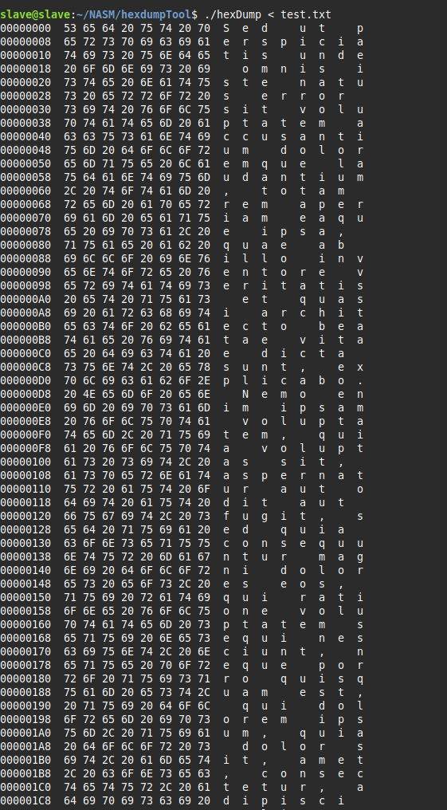

# 🛠️ HexDump Tool  

## 📜 Description  
**HexDump Tool** is a lightweight program written in **x86-64 Assembly** that allows users to visualize the contents of a file in **hexadecimal format** along with its **ASCII representation**.  

## 🚀 Features  
- 🏷 **Displays memory addresses** in hexadecimal (`00, 08, 10, 18, etc.`).  
- 🔢 **Converts file bytes** into their hexadecimal representation.  
- 🔡 **Shows the ASCII equivalent** of each byte read.  
- ⚡ **Optimized for efficiency** using **Linux syscalls** for direct system interaction.  

## 🖼️ Screenshot (Example Output)  
  

## 🔍 How It Works  
The tool processes input from `stdin`, converts it to hexadecimal and ASCII formats, and outputs it to `stdout`.  

### 📌 Algorithm  
1️⃣ **Read** data from `stdin` into a buffer.  
2️⃣ **Process the buffer** byte by byte:  
   - Extract **lower** and **upper nibbles**.  
   - Convert them into **hex values**.  
   - Store results in a hex table.
     
3️⃣ **Send processed output** to `stdout`.  
4️⃣ **Repeat** until all data from `stdin` is processed.  
5️⃣ **Terminate** execution after reaching the end of input.  

## 🔗 Dependencies  
- **Linux OS** (due to syscall usage)  
- **Assembler (NASM)** for compilation  

## 🏗️ Compilation & Execution  
Compile using NASM:  
```bash
nasm -f elf64 main.asm -o hexDump.o
ld hexDump.o utils_lib.o -o hexDump


